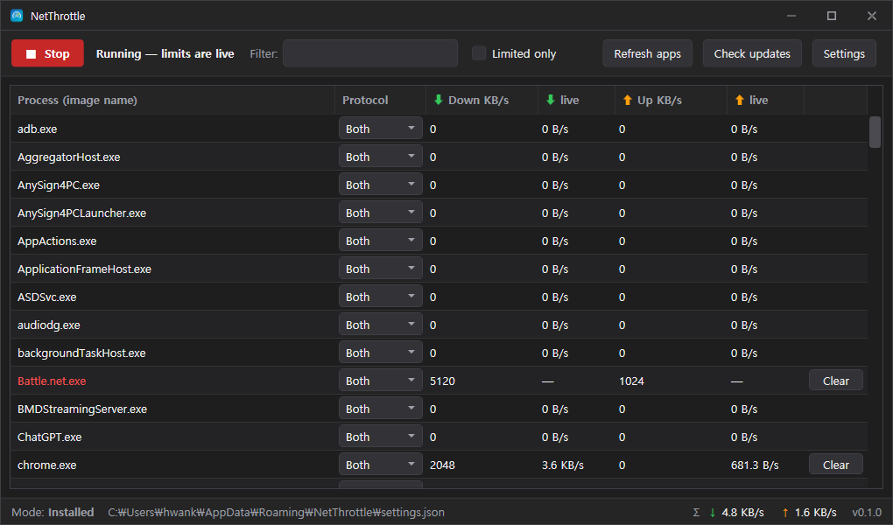

# NetThrottle

<p align="center">
  
</p>

A Windows desktop app that rate-limits per-process network bandwidth, with separate download and upload caps for each application.

**English** | [한국어](README.ko.md)

## Features

- Per-process bandwidth limits keyed by image name (e.g. `chrome.exe`), so rules survive process restarts.
- Independent **download** and **upload** caps in KB/s, where `0` means unlimited.
- Protocol selection per rule: **TCP**, **UDP**, or **Both**.
- Traffic shaping that **delays** packets to honor the configured average rate instead of dropping them.
- Live up/down throughput shown per process, sampled once per second.
- Live list of every running process (name-sorted) with inline caps that apply instantly.
- A limited process stays listed (its name turns **red**) after it exits, and the limit re-applies automatically when it runs again.
- Live total up/down readout and a "limited only" filter.
- Closing the window minimizes to the notification tray; throttling keeps running in the background.
- Multi-language UI that follows the OS language (English & Korean included). Add a language by dropping a JSON file into the `locales/` folder next to the executable.
- Settings live in a dedicated dialog: language, **start with Windows** (elevated scheduled task), **start minimized to the tray**, and a **KB/s ⇄ MB/s** unit toggle.
- Sort any column (e.g. by live usage to find bandwidth hogs); the window remembers its size and position.
- Clean WPF UI on .NET 9 with a custom dark title bar and a filterable process grid.
- Installer and portable distributions, with automatic update notifications from GitHub Releases.

## How it works

NetThrottle shapes traffic at the network layer using [WinDivert](https://github.com/basil00/WinDivert). A dedicated pump thread reads every TCP/UDP packet, attributes it to a process, and releases it through a per-(process, direction) token bucket.

The pipeline is:

1. **WinDivert** captures TCP/UDP packets at the network layer (filter `tcp or udp`).
2. The packet's local port is mapped to a **PID** via the Windows IP Helper extended TCP/UDP tables, and the PID resolves to a process image name.
3. Rules are matched by **image name + protocol**.
4. Matching packets pass through a **token bucket** that delays them to enforce the configured rate. Packets are never dropped — they are scheduled and re-sent.

Throughput counters are accumulated for every matched process and differentiated into a live rate by the UI once per second.

## Requirements

- **Windows 10 or 11 (x64).**
- Must run **as Administrator** — WinDivert loads a signed kernel-mode driver.
- `WinDivert.dll` and `WinDivert64.sys` (v2.2.x, x64) must sit next to `NetThrottle.exe`. The installer and portable zip bundle these for you.

## Installation

### Installer (`.exe`)

1. Download `NetThrottle_vX.Y.Z_Setup.exe` from the [latest release](https://github.com/akon47/NetThrottle/releases/latest).
2. Run it and follow the wizard. Administrator elevation is requested automatically.
3. Launch NetThrottle from the Start menu or desktop shortcut.

Installed builds store settings in `%AppData%\NetThrottle\settings.json`.

### Portable (`.zip`)

1. Download `NetThrottle_vX.Y.Z_Portable.zip` from the [latest release](https://github.com/akon47/NetThrottle/releases/latest).
2. Extract the `NetThrottle/` folder anywhere you like.
3. Run `NetThrottle.exe` directly (it will request Administrator elevation).

The portable folder ships a `portable.marker` file next to the executable. When that marker is present, `settings.json` is stored next to the exe, so the whole folder is self-contained and movable.

## Usage

1. Press **Start** to begin monitoring and shaping. The app requires Administrator elevation to open the WinDivert driver.
2. The grid lists every running process by image name, sorted alphabetically. Type in **Filter** to find one, or click **Refresh apps** to update the list.
3. On a process row, set a **Down KB/s** and/or **Up KB/s** cap. `0` means unlimited for that direction; the cap applies immediately while the engine is running.
4. Optionally change the **Protocol** (TCP, UDP, or Both) for that process.
5. The **↓ live** and **↑ live** columns show each process's current throughput, updated once per second.
6. A process you have limited stays in the list after it exits — its name turns **red** — and the limit re-applies automatically when it runs again. Click **Clear** to remove a limit. Press **Stop** to release all traffic.

## Updating

On launch, NetThrottle queries the GitHub Releases API for the latest release and compares the tag to its own assembly version. When a newer version is available, a banner appears with **Update now** and **Skip** actions. You can also trigger a check manually with **Check updates**.

- **Installed build:** can self-update — it downloads the `*_Setup.exe` asset, relaunches it elevated, and exits.
- **Portable build:** does not self-install; it links to the releases page for a manual download.

## Building from source

Install the [.NET 9 SDK](https://dotnet.microsoft.com/download), then build the solution:

```bash
dotnet build NetThrottle.sln -c Release
```

To run locally you still need the WinDivert native files present and must launch elevated. For development, drop `WinDivert.dll` and `WinDivert64.sys` (v2.2.x, x64) into:

```
src/NetThrottle.Engine/native/x64/
```

The Engine project copies them to the build output. Alternatively, place the two files beside the built `NetThrottle.exe`.

### Verifying the engine

`tools/NetThrottle.SmokeTest` is a headless end-to-end check. It transfers bulk data over a loopback TCP socket with the engine off (baseline) and again with a per-process cap, then compares the throughput. Place the WinDivert files next to the built `NetThrottle.SmokeTest.exe` and run it **as administrator** — a passing run shows the throttled rate collapsing to near the cap (e.g. ~5400 MB/s → ~7 MB/s for a 4 MB/s cap).

## Releasing

Releases are tag-driven. Pushing a `vX.Y.Z` tag runs [`.github/workflows/release.yml`](.github/workflows/release.yml), which:

1. Derives the version from the tag.
2. Publishes a self-contained single-file `win-x64` executable (`NetThrottle.exe`).
3. Downloads WinDivert and bundles `WinDivert.dll` + `WinDivert64.sys`.
4. Produces and uploads exactly two assets to the GitHub Release:
   - `NetThrottle_vX.Y.Z_Setup.exe` — NSIS installer.
   - `NetThrottle_vX.Y.Z_Portable.zip` — extract the `NetThrottle/` folder and run `NetThrottle.exe` directly.

```bash
git tag v1.2.3
git push origin v1.2.3
```

## Project structure

| Project | Target | Description |
| --- | --- | --- |
| `src/NetThrottle.Core` | `net9.0` | Models (`ThrottleRule`, `Direction`, `ProtocolKind`), the token-bucket shaper, and settings (`AppSettings`, `SettingsStore`). |
| `src/NetThrottle.Engine` | `net9.0-windows` | WinDivert P/Invoke, IP Helper port→PID mapping, the packet pump (`PacketEngine`), and packet parsing. |
| `src/NetThrottle.App` | `net9.0-windows` (WPF) | MVVM UI, services (`EngineController`, `SettingsService`, `ProcessListProvider`, `GitHubUpdateService`), and the `requireAdministrator` manifest. |
| `tools/NetThrottle.SmokeTest` | `net9.0-windows` | Headless loopback throughput check that verifies real throttling (run as administrator). |

## License

Released under the [MIT License](LICENSE).

Author: Kim, Hwan (akon47@naver.com)
